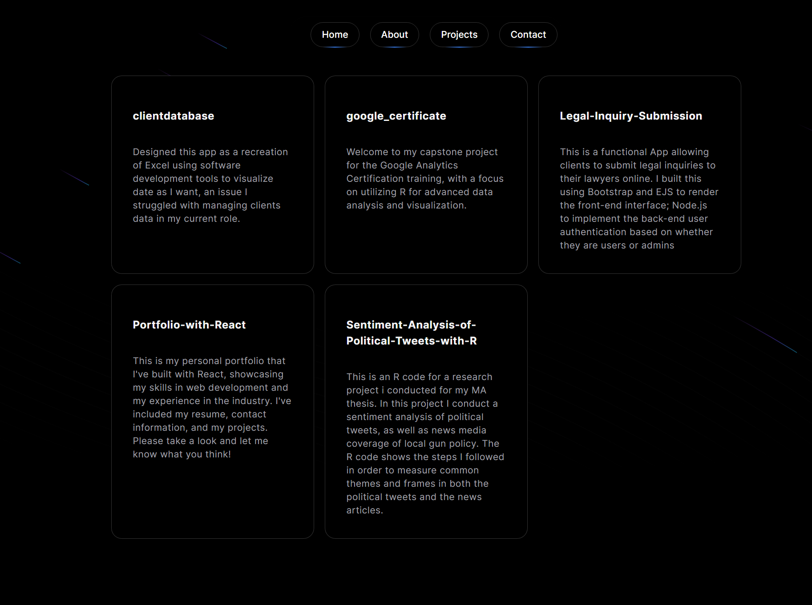

# 🎨 My Personal Portfolio 🌐

Welcome to my digital showcase! This Next.js portfolio website is a testament to my passion for web development and design. It's where I share my projects, experiences, and a bit of my personality. 🎉 Check it out [Here!](https://fec306c9.myportfolio-cvr.pages.dev/)

## 🚀 Features

- **Built with Next.js 14:** Leverages client-side rendering, automatic code splitting, and optimized bundling for a lightning-fast experience.
- **Styled with Aceternity UI:** Utilizes a modern and stylish UI component library for a polished and visually appealing design.
- **Responsive Design:** Seamlessly adapts to different screen sizes, ensuring a great experience on desktops, tablets, and mobile devices.
- **Project Showcase:** Displays a curated collection of my best work, highlighting my technical expertise and problem-solving skills.
- **About Me Section:** Provides a glimpse into my background, interests, and what drives me as a developer.
- **Contact Form:** Enables potential clients or collaborators to reach out easily.

## 🛠️ Technologies Used

- **Next.js 14** ⚛️
- **Aceternity UI** 🎨
- **React.js**
- **TypeScript**
- **Tailwind CSS**
- **Framer Motion**

